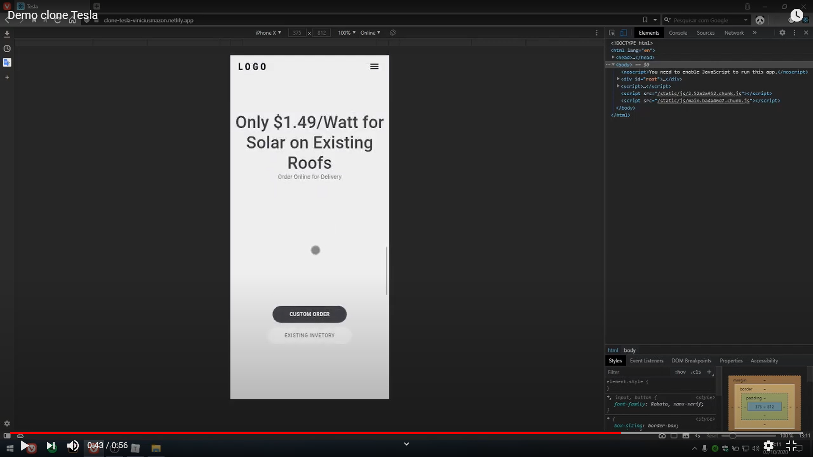

# 💡 Sobre o projeto

Clone das animações da página inicial da Tesla, utilizando Framer-motion.

**Link da demo**: [clone-tesla-viniciusmazon.netlify.app](https://clone-tesla-viniciusmazon.netlify.app/)

**Vídeo da demo**: 

[](https://youtu.be/zcEsXvf6q54 "demo Tesla clone")


Desenvolvido seguindo a aula  [Homepage da Tesla com ReactJS | UI Clone](https://www.youtube.com/watch?v=Mf4Se4ZGcG8), créditos a [Rocketseat 🚀](https://github.com/Rocketseat)


# 🛸 Tecnologias

* ReactJS
* Typescript
* Styled-components
* Framer-motion


# ⚙️ Como utilizar

Clone o repositório:

```bash
git clone https://github.com/ViniciusMazon/clone-tesla.git
```

Instale as dependências:

```bash
yarn
```

Rode utilizando o script

```bash
yarn start
```


# 🖖🏻 Como contribuir

- Faça um fork desse repositório;
- Clone esse repositório em sua máquina: `https://github.com/ViniciusMazon/clone-tesla.git`
- Cria uma branch com a sua feature: `git checkout -b minha-feature`;
- Faça commit das suas alterações: `git commit -m 'feat: Minha nova feature'`;
- Faça push para a sua branch: `git push origin minha-feature`.

Depois que o merge da sua pull request for feito, você pode deletar a sua branch.


# 📝 Licença

Esse projeto está sob a licença MIT. Veja o arquivo LICENSE para mais detalhes.